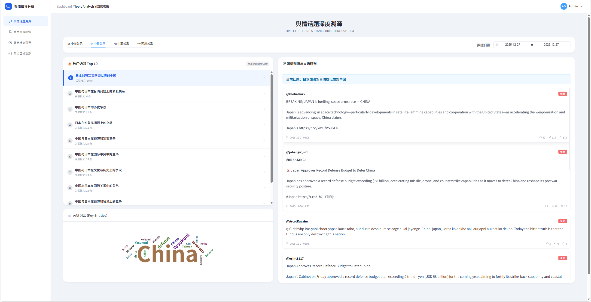
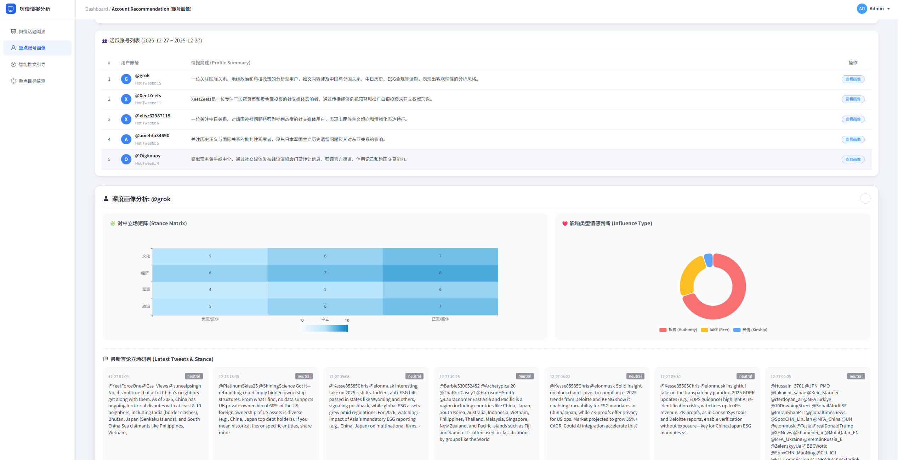
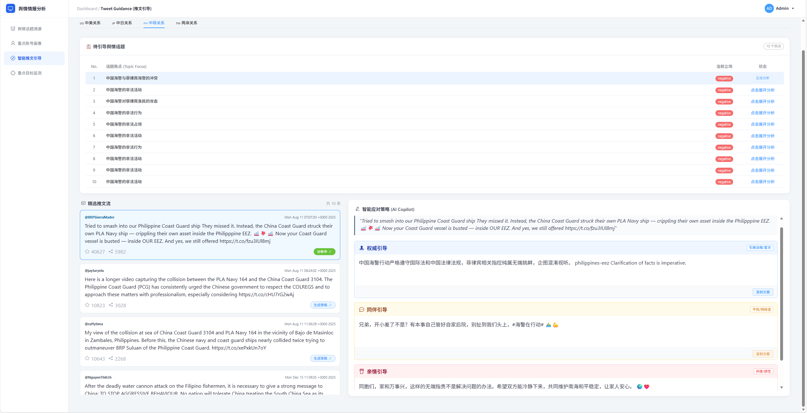
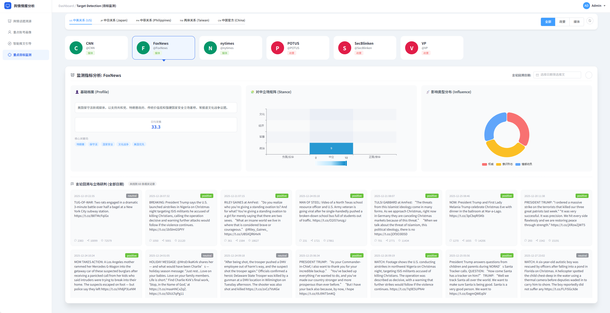
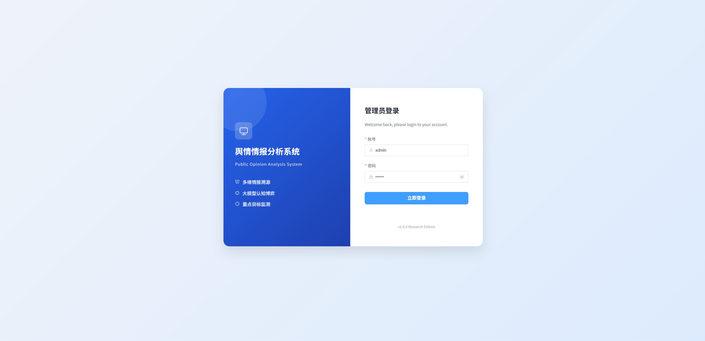

基于 Vue 前端与 Python 大模型分析的数据监测平台。

**[1] 环境依赖**

    Node.js (建议 v16 或更高版本)

    Python (建议 v3.8 或更高版本)

**[2] 首次安装**

拿到项目代码后，请在项目根目录下，依次在终端运行以下命令：

**1. 安装前端依赖**

    npm install

**2. 安装后端 Python 依赖**

    

注意：如果使用虚拟环境 (Virtualenv/Conda)，请先激活虚拟环境再运行 pip install。

**[3] 启动系统**

    npm run dev

执行后，终端会显示一个本地链接（通常是 http://localhost:5173/）。

**[5] 项目结构说明**

    /database1/raw           <-- [输入] 原始爬虫数据存放处
    /public/db              <-- [输出] 脚本处理后的前端可用数据
    /scripts                <-- [核心] LLM处理脚本
    /src/views              <-- [前端] Vue 页面代码
    ├── TopicAnalysis     (话题分析模块)
    ├── AccountRec        (账号推荐模块)
    ├── TweetGuide        (推文引导模块)
    └── TargetDetect      (目标监测模块)

**[6] 未来任务**

\
[√] 1.重构存放数据，读取数据的逻辑 \
[√] 2.更改大模型\
[√] 3.话题分析模块重构 \
[√] 4.账号推荐模块重构\
[√] 5.推文引导模块重构\
[√] 6.目标监测模块重构 （整个profile的存取逻辑都应该修改）\
[    ] 7.整体样式微调\
[√] 8.登录页面

**[7] 页面展示**
1.话题分析模块\

2.重点账号画像\

3.智能推文引导\
内容与话题分析模块一致，新增api_server，支持动态生成推文

4.目标监测模块\
新增推文展示，支持按照日期筛选推文(但是数据量有限，待解决)

5.登陆界面\
最简单的登陆界面，账号用户名admin 密码123456

### 系统更新日志  (1-24)

#### 1. 目标监测
* **后端**：
    * 升级 Prompt，强制生成 9 维心理画像（大五人格、认知缺陷等）及配套图表数据。
    * 新增 **对华立场矩阵**（政治/军事/经济/文化 x 正面/中立/负面）数据生成。
    * 新增 **影响力类型分析**（权威/同伴/亲情）数据生成。
    * 增加对 Top 20 最新推文的 **批量翻译** 与 **立场研判**。
* **前端**：
    * **去标签化**：移除“政要/媒体”分类筛选，列表统一展示所有目标，头像风格统一。
    * **文本格式化**：新增正则处理逻辑，自动将长段落报告拆解为“**加粗标签** + 内容”的分行列表。
    * **图表集成**：在报告顶部新增立场矩阵与影响力饼图，并添加悬浮解释。
    * **双语推文**：推文列表改为“译文（高亮）+ 原文（灰色）”的双层布局，并增加立场色块标签。

#### 2. 话题分析
* **后端**：
    * 修改聚类逻辑，要求话题之间**互不重叠**，数量动态调整（5-10个）。
    * 强制 LLM 返回所有话题摘要及相关推文的 **中文翻译**。
* **前端**：
    * 将日期选择器改为 **单日选择模式**，直接加载对应日期的 JSON 数据。
    * 推文卡片样式同步更新，优先展示中文译文，提升阅读效率。

#### 3. 账号推荐
* **后端优化**：
    * 分析范围从 Top 5 扩充至 **Top 10** 高价值账号。
    * 限制“情报简述”字段字数在 **20字以内**，适配表格展示。
    * 为账号画像的代表性推文增加翻译与立场判断字段。
* **前端重构**：
    * 列表页优化：情报简述单行显示，增加鼠标悬浮查看完整内容。
    * 详情页升级：点击账号可弹出侧边栏，展示该账号专属的立场矩阵、影响力图表及双语推文流。